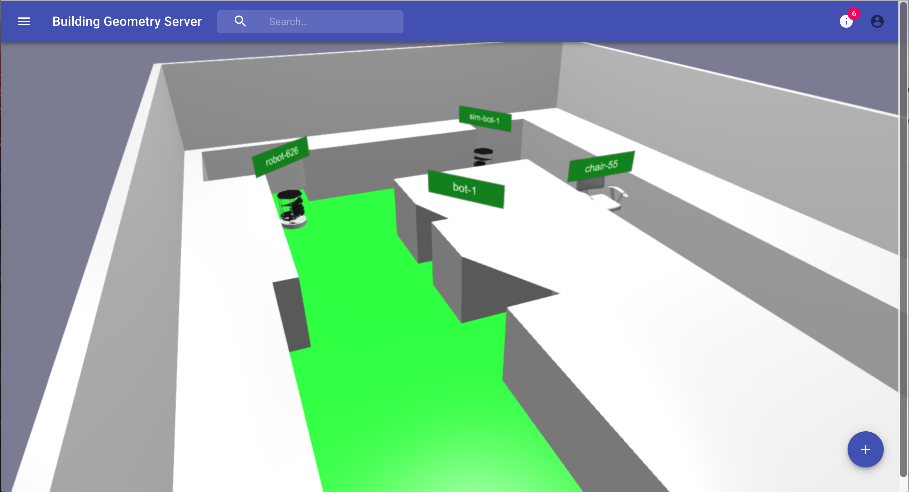

# Digital Points
A real-time geometry server for applications in robotics and building management.



## Quick start

Start the databases
```sh
source .env
docker-compose up
```

Start the API
```
cd ui 
npm i
npm start
```

Start the UI
```
cd ui 
npm i
npm start
```


## Building the docker images
```sh
docker build -t digitalpoints/api:latest api
docker build -t digitalpoints/ui:latest ui
docker-compose up
```


## Deployment (GKE)

Google CloudBuild is used to build and deploy the codebase.

Every commit is built and tested using the same CI pipeline. The UI and API components are automatically deployed to production whenever a pull request is merged into `master`. Deployment configuration is stored in /deployment/cloudbuild.


## About
The design principles of the DBM-server:
* Persistance: The full object trajectories are persisted for future data analysis
* Speed: The target trajectory update rate is 0.1-1 seconds, allowing real-time decision-making
* Geometry: The system stores all object and environment geomerty
* Visualization: Geomerty is visible through a web application

## License
MIT
